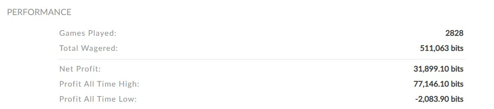

在TradingView聊天室一老哥给说了一个BTC最小单位的下注游戏网站. 研究了一番发现站内已有内置JS执行下注的脚本, 无奈不喜欢JS的语法, 于是改用C#控制浏览器来进行自动下注.

这是我账户的summary, 本金0.1个btc, 利用源码中的策略在一个月的时间内, 最高赚到0.077个btc, 最终以0.031个btc(大概600刀)收场.
注意: 该策略可能已经失效<盈亏自负>, 但是可以clone并修改为自己的策略逻辑以进行自动下注.
